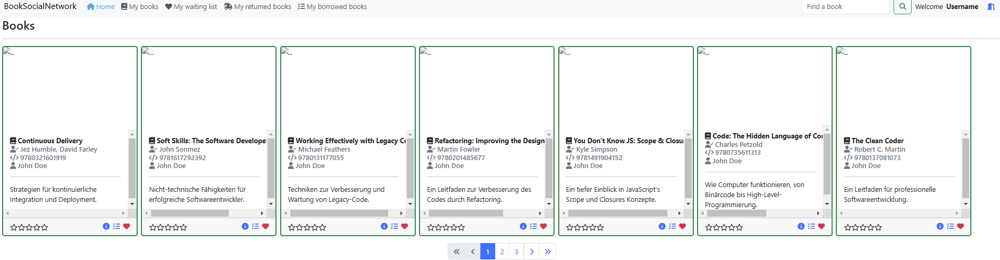
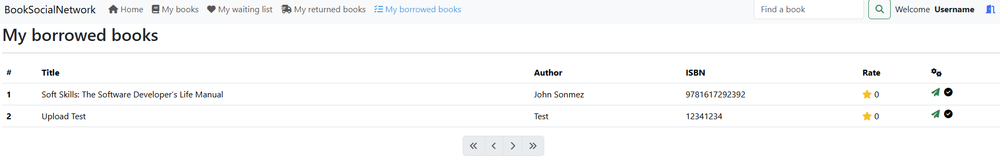
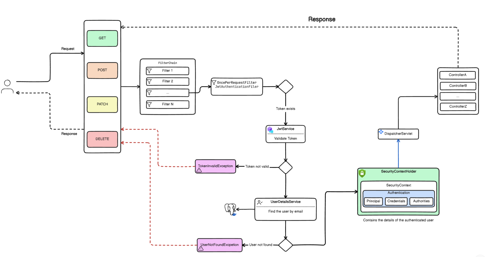
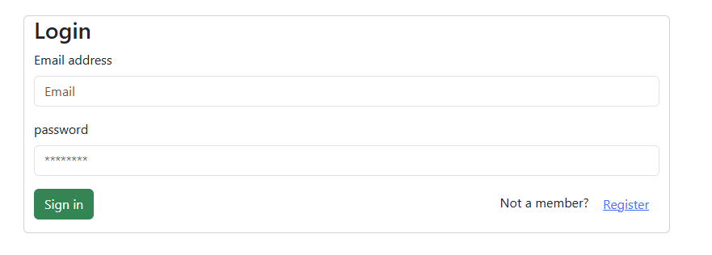
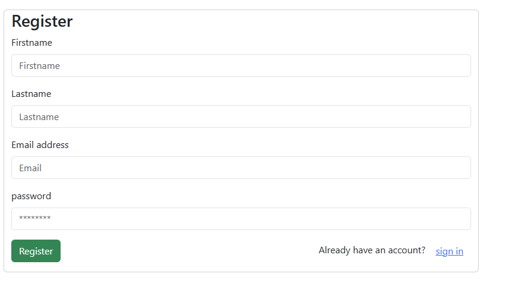
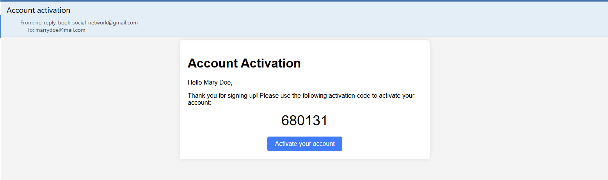
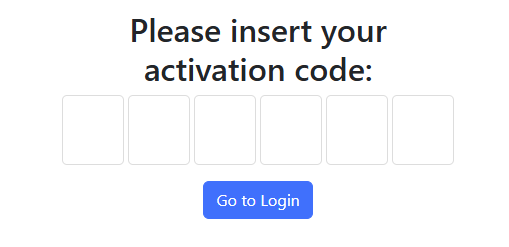

# Book Social Network
---

## Functionality

### Book Management
- Users can create, update, and delete books.
- Each book has attributes like:
  - **Title**
  - **Author**
  - **Genre**
  - **Description**
  - **Cover image**
  - **ISBN**
  - Etc.
- Create, Read, Update & Delete Books (CRUD operations).
- Pagination functionality 

### Book Sharing
- Users can mark books as available for sharing.
- Other users can view a list of available books.
- Functionality to share a book with another user.
- Users can archive books they no longer want to share but want to keep a record of.
  
### Homepage

### Book Borrowing
- Users can borrow a book.
- Track the status of each book:
  - *Available*
  - *Borrowed*
  - *Archived*
- Mechanism to prevent multiple users from borrowing the same book simultaneously.
- Mechanism to return the book
- Mechanism to rate the book
#### Book return page:

#### Book rate page: 

### User Authentication
- User registration via email & login functionality.
- Spring Security for backend authentication.
- JWT for secure token-based authentication.

### Spring-Security

### Login

### Registration

### E-Mail verification

